review\_2
================
Nicholas Lester

**Clear memory**

``` r
rm(list=ls(all=T))
```

**Load libraries**

``` r
library(lmerTest)
library(dplyr)
library(ggplot2)
library(languageR)
library(visreg)
library(mgcv)
library(car)
library(effects)
```

**Load the supplementary data** (`si`)

``` r
si = read.table(file="./03_data.txt", header=T, sep="\t", quote="", comment.char="")
```

**Basic properties of the data**

``` r
# Overview of the dataframe
str(si)
```

    ## 'data.frame':    7171 obs. of  32 variables:
    ##  $ Audiofile     : int  2001 2001 2001 2001 2001 2001 2001 2001 2001 2001 ...
    ##  $ Turn          : int  10 12 13 14 24 3 34 39 4 41 ...
    ##  $ Particle      : int  0 0 0 0 0 0 0 0 0 0 ...
    ##  $ Dative        : int  0 0 0 0 0 0 0 0 0 0 ...
    ##  $ Genitive      : int  0 0 1 0 0 0 1 0 0 0 ...
    ##  $ Comparatives  : int  0 0 0 0 0 0 0 0 0 0 ...
    ##  $ ThatZero      : int  0 0 1 0 0 0 0 0 0 2 ...
    ##  $ InfGerund     : int  0 0 0 0 0 0 0 0 0 0 ...
    ##  $ ThatGerund    : int  0 0 0 0 0 0 0 0 0 0 ...
    ##  $ Future        : int  0 0 0 0 0 0 0 0 0 0 ...
    ##  $ Deontic       : int  1 0 0 0 0 1 0 0 0 0 ...
    ##  $ Possession    : int  0 0 0 0 0 0 0 0 0 0 ...
    ##  $ RestRel       : int  0 0 0 0 0 0 0 0 0 0 ...
    ##  $ NotNo         : int  0 0 0 0 0 0 0 0 0 0 ...
    ##  $ Contraction   : int  1 0 0 0 0 0 0 1 1 0 ...
    ##  $ BodyOne       : int  0 2 0 0 0 0 0 0 0 0 ...
    ##  $ CoordPro      : int  0 0 0 0 0 0 0 0 0 0 ...
    ##  $ Quote         : int  0 0 0 0 0 0 0 0 0 0 ...
    ##  $ Try           : int  0 0 0 0 0 0 0 0 0 0 ...
    ##  $ Tried         : int  0 0 0 0 0 0 0 0 0 0 ...
    ##  $ UnRestRel     : int  0 0 0 0 0 0 0 0 0 0 ...
    ##  $ ThereIsAre    : int  0 0 0 0 0 0 0 0 0 0 ...
    ##  $ FilledPause   : int  0 0 1 0 0 1 0 0 0 0 ...
    ##  $ Speaker_Number: int  1044 1044 1044 1044 1044 1044 1044 1044 1044 1044 ...
    ##  $ NWords        : int  25 25 28 10 10 36 23 25 16 32 ...
    ##  $ NVarb         : int  2 2 2 0 0 1 1 1 1 2 ...
    ##  $ Silence       : num  2.744 0.071 0.261 0.756 0.45 ...
    ##  $ Total.Duration: num  8.13 6.87 7.7 3.48 4.46 ...
    ##  $ NChar         : int  85 102 104 39 30 142 93 91 59 115 ...
    ##  $ AvgChar       : num  3.4 4.08 3.71 3.9 3 ...
    ##  $ SRate         : num  3.07 3.64 3.64 2.87 2.24 ...
    ##  $ SilencebyWord : num  0.10976 0.00284 0.00932 0.0756 0.045 ...

``` r
# Preview a row
si[1,]
```

    ##   Audiofile Turn Particle Dative Genitive Comparatives ThatZero InfGerund
    ## 1      2001   10        0      0        0            0        0         0
    ##   ThatGerund Future Deontic Possession RestRel NotNo Contraction BodyOne
    ## 1          0      0       1          0       0     0           1       0
    ##   CoordPro Quote Try Tried UnRestRel ThereIsAre FilledPause Speaker_Number
    ## 1        0     0   0     0         0          0           0           1044
    ##   NWords NVarb Silence Total.Duration NChar AvgChar    SRate SilencebyWord
    ## 1     25     2   2.744         8.1335    85     3.4 3.073708       0.10976

**Descriptive stats**  
As reported in revised MS (pp. 14-15):  
\- 190 transcripts (corresponding to `si$Audiofile`?)  
\- 7171 total turns (`si$Turn`)  
\- 6278 total variable contexts (must be derived by summing sums of
columns 3-22)  
\- 3473 turns with at least one variable context (for which row sum of
columns 3-22 \!= 0)  
\- 2164 turns contain at least one filled pause  
\- 5 maximum number of filled paused per turn  
\- 111 mean silence per turn

``` r
# Number of transcripts
cat(paste0("Number of transcripts: ", length(unique(si$Audiofile)), "\n"))
```

    ## Number of transcripts: 289

``` r
# Number of total turns
cat(paste0("Number of turns: ", nrow(si), "\n"))
```

    ## Number of turns: 7171

``` r
# Number fo variable contexts
cat(paste0("Number of variable contexts: ", sum(colSums(si[, 3:22])), "\n"))
```

    ## Number of variable contexts: 6278

``` r
# Turns with/out variable contexts
cat(paste0("Number of turns w/o variable contexts: ", sum(rowSums(si[, 3:22])==0), "\n"))
```

    ## Number of turns w/o variable contexts: 3698

``` r
cat(paste0("Number of turns w/ variable contexts: ", sum(rowSums(si[, 3:22])!=0), "\n"))
```

    ## Number of turns w/ variable contexts: 3473

``` r
# Are there any audiofiles that lack variable contexts entirely?
files.wo = unique(si$Audiofile[rowSums(si[, 3:22])==0])
files.w = unique(si$Audiofile[rowSums(si[, 3:22])!=0])

# Files in which 0 turns contain at least one variable context
cat(paste0("Files w/o any variable contexts: ", paste(setdiff(files.wo, files.w), collapse=", "), "\n"))
```

    ## Files w/o any variable contexts: 2597, 4157

``` r
# Files in which every turn contains at least one variable context
cat(paste0("Files in which every turn has > 0 variable contexts: ", paste(setdiff(files.w, files.wo), collapse=", "), "\n"))
```

    ## Files in which every turn has > 0 variable contexts: 3248, 4149, 4163

``` r
# Filled pauses
## Total number
cat(paste0("Number of filled pauses: ", sum(si$FilledPause), "\n"))
```

    ## Number of filled pauses: 2939

``` r
## Turns with filled pauses
cat(paste0("Number of turns w/ filled pauses: ", sum(si$FilledPause!=0),"\n"))
```

    ## Number of turns w/ filled pauses: 2164

``` r
## Max number of filled pauses
cat(paste0("Maximum number of filled pauses: ", max(si$FilledPause), "\n"))
```

    ## Maximum number of filled pauses: 5

``` r
## Files with/out filled pauses
files.w.fp = unique(si$Audiofile[si$FilledPause==0])
files.wo.fp = unique(si$Audiofile[si$FilledPause!=0])

#### Files with filled pauses
cat(paste0("Files w/o any filled pauses: ", paste(setdiff(files.wo.fp, files.w.fp), collapse=", "), "\n"))
```

    ## Files w/o any filled pauses: 3248

``` r
###### How many turns?
cat(paste0("-- but it has only ", sum(si$Audiofile==3248), " turn(s)\n"))
```

    ## -- but it has only 1 turn(s)

``` r
#### Files without filled pauses
cat(paste0("Files in which every turn has a filled pause: ", paste(setdiff(files.w.fp, files.wo.fp), collapse=", "), "\n"))
```

    ## Files in which every turn has a filled pause: 2807, 2979, 3266, 3799, 3982, 3994, 4012, 4069, 4157

``` r
## A new question: how many turns per file?
turn.cts = si %>%
           group_by(Audiofile) %>%
           summarize(n.turns = n())

#### Density of turns per file
ggplot(turn.cts, aes(x = n.turns)) +
       geom_histogram(aes(y = ..density..), color="darkblue", fill="white") +
       geom_density(alpha=.2, fill="darkred") +
       xlab("Number of turns") +
       ggtitle("Distribution of transcript lengths (turns)") +
       theme_bw() +
       theme(plot.title = element_text(hjust = 0.5))
```

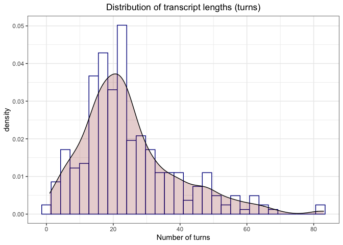<!-- -->

``` r
## Mean silence per turn (defined as silence/number of words)
cat(paste0("Mean duration of silence per turn: ", mean(si$SilencebyWord)*1000, "\n"))
```

    ## Mean duration of silence per turn: 110.910749626691

``` r
## Plotting the relationship between silence and length in words
ggplot(si, aes(x = NWords, 
               y = Silence, 
               color = as.factor(si$Speaker_Number),
               fill = as.factor(si$Speaker_Number))) + 
      geom_point(alpha=0.5) + 
      geom_smooth(method = "gam", formula = y~s(x)) + 
      theme_bw() + 
      ggtitle("Silence vs. turn length in words") +
      xlab("Number of words") + 
      ylab("Silence (s)") +
      labs(fill="Speaker ID", color="Speaker ID")
```

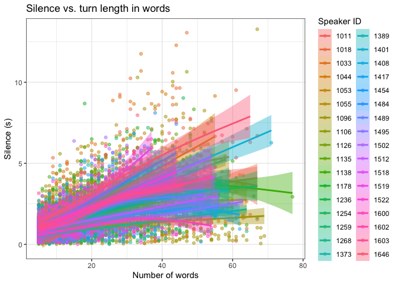<!-- -->

``` r
## What about the relationship between filled pauses and word counts?
ggplot(si, aes(x = as.factor(si$FilledPause), 
               y = NWords, 
               color = as.factor(si$Speaker_Number),
               fill = as.factor(si$Speaker_Number))) + 
      geom_boxplot(alpha=0.5, notch=T) +
      theme_bw() + 
      ggtitle("Filled pauses vs. turn length in words") +
      xlab("Number of filled pauses") + 
      ylab("Number of words") +
      labs(fill="Speaker ID", color="Speaker ID")
```

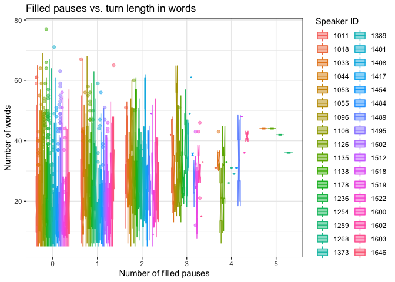<!-- -->

``` r
## ... and between filled pauses and silence?
ggplot(si, aes(x = as.factor(si$FilledPause), 
               y = Silence, 
               color = as.factor(si$Speaker_Number),
               fill = as.factor(si$Speaker_Number))) + 
      geom_boxplot(alpha=0.5, notch=T) +
      theme_bw() + 
      ggtitle("Filled pauses vs. silence") +
      xlab("Number of filled pauses") + 
      ylab("Silence (s)") +
      labs(fill="Speaker ID", color="Speaker ID")
```

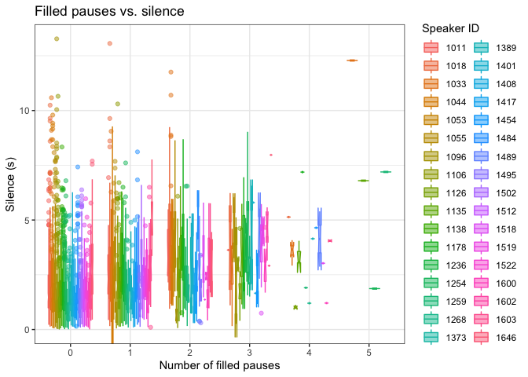<!-- -->

``` r
## Do any speakers appear in more than one file?
any(table(unique(si[, c("Audiofile", "Speaker_Number")]))>1)
```

    ## [1] FALSE

``` r
any(table(unique(si[, c("Audiofile", "Speaker_Number")])$Audiofile)>1)
```

    ## [1] TRUE

As with the prior SI (submitted with the original MS), there is a
mismatch between the number of transcripts reported and those that
appear in the dataset. Here, the number is off by 108 (a sizeable
discrepancy).

There also appears to be a typo on p. 14 regarding the number of turns
with 0 variable contexts (should be 3698, but just repeats the 3473,
i.e., the number of turns with at least one variable context).

Strangely, there are two files in which no variable contexts were
observed. Is this true?

Another oddity: one file contains zero filled pauses. But this can be
partially explained by the fact that it contains only a single turn. A
look at the distribution of turns per file shows that several other
files likewise contain very few turns.

Regarding mean duration of silence per turn, why don’t you simply use
the total silence? Doesn’t this assume a linear relationship between
words and additional silence (i.e., that each word can be seen as adding
a relatively similar amount of silence)? A look at the scatter plot
(with GAM smooths per speaker) suggests that the trend generally
positive for shorter turns, but levels off for longer turns (in most
cases). The plot also shows a great degree of individual variation in
the relationship, especially for longer turns. I don’t think using one
or the other will affect the findings, but that is an empirical
question.

**At the very least, I suggest a change in the how you refer to the term
you do include in your model**: “mean silence per turn” is inaccurate;
“mean silence per word” is what you actually measure.

I also plot relationships between filled pauses and word counts, as well
as filled pauses and silence. All show generally positive correlations,
but again, a great deal of individual variation. This provides some
support for the two being treated as measures of the same thing (to some
extent at least, namely, the presence of cognitive load). But
conceptually, filled and silent pauses are opposed, but only in one
direction: filled pauses “eat” silence (i.e., replace what could have
been silence with noise) but not vice-versa (what would it mean to say
that silence replaced what could have been a filled pause?).

A final note: each speaker appears in only one file (though some files
contain multiple speakers). This has ramifications for the random effect
structure (nesting speakers in file).

A good amount the above discussion suggests that we should investigate
the collinearity of the variables in question. We know that certain of
them of correlated, but is this correlation potentially harmful?

**Collinearity**

``` r
collin.fnc(si %>% 
           select(NVarb, AvgChar, SRate, Total.Duration))$cnumber
```

    ## [1] 22.7699

This value falls below at least one threshold (k = 30; Baayen, 2008),
indicating that the degree of multicollinearity is probably tolerable.

**Adding the missing columns** The dataset as submitted does not contain
columns for the binarized transformations of the FilledPause and NVarb
columns. Therefore, we must construct those ourselves.

``` r
si$FilledPauseBinary = as.factor(ifelse(si$FilledPause==0, "absent", "present"))
si$NVarbBinary = as.factor(ifelse(si$NVarb==0, "absent", "present"))
```

**Adding some additional columns**  
One possible additional variable is the spread of the types of variable
contexts within turns. A simple metric is the type-token ratio (number
of types of variable contexts over the number of variable contexts
overall in the turn). Another potential variable of interest is the
number of speakers. Since the data are all monologic or dialogic, this
variable can be encoded as a factor.

``` r
# Number of variable context types
si$NVarbTypes = apply(si[, 3:22], 1, function(x) sum(x>0))

# Distribution of variable context types
ggplot(si, aes(x = NVarbTypes)) +
       geom_histogram(aes(y = ..density..), 
                      color="darkblue", 
                      fill="white") +
       geom_density(alpha=.2, fill="darkred") +
       xlab("Number of variable types") +
       ggtitle("Distribution of variable type counts") +
       theme_bw() +
       theme(plot.title = element_text(hjust = 0.5))
```

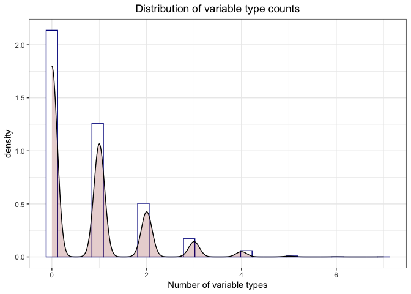<!-- -->

``` r
# TTR
si$VarbTTR = si$NVarbTypes/si$NVarb
si$VarbTTR = ifelse(is.na(si$VarbTTR), 0, si$VarbTTR)

# Distribution of TTR
ggplot(si, aes(x = VarbTTR)) +
       geom_histogram(aes(y = ..density..), 
                      color="darkblue", 
                      fill="white") +
       geom_density(alpha=.2, fill="darkred") +
       xlab("TTR") +
       ggtitle("Distribution of variable types per token") +
       theme_bw() +
       theme(plot.title = element_text(hjust = 0.5))
```

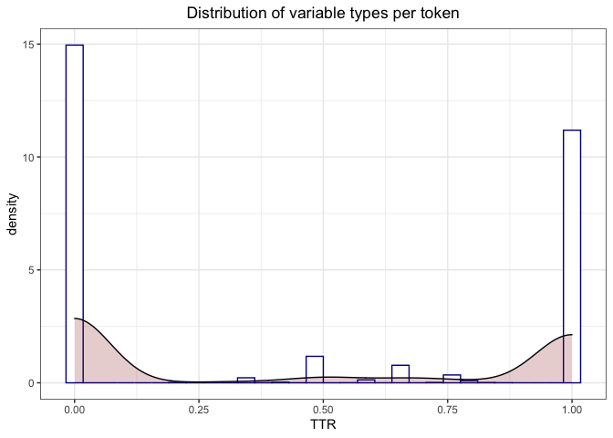<!-- -->

``` r
# Number of speakers
si = si %>%
     group_by(Audiofile) %>% 
     summarize(n.spkr = length(unique(Speaker_Number))) %>%
     mutate(logicity = if_else(n.spkr == 1, "monologue", "dialogue")) %>%
     right_join(., si, by="Audiofile")
```

The vast majority of instances are either equal to 0 (i.e., no variable
contexts) or 1 (one type per token). The remainder of the observed
values occupy the middle-high range of diversity (i.e., adding variable
contexts tends to involve introducing different such contexts).

Finally, we can scale the variables.

``` r
# Scale using z-scores
scaled = as.data.frame(scale(si[, c(27:34, 37:38)]))
## Fix column names
colnames(scaled) = paste0(colnames(scaled), ".scaled")

# Add the scaled columns
si = bind_cols(si, scaled) %>% as.data.frame()
```

**Filled pause model**

``` r
###############################
# Replication of reported model
###############################
fp.mod.rep = glmer(FilledPauseBinary ~ NVarbBinary*Total.Duration + AvgChar + SRate + (1|Speaker_Number), data = si, family="binomial", glmerControl(optimizer="bobyqa", optCtrl=list(maxfun=2e5)))

# Summary + p-values from lmerTest
summary(fp.mod.rep)
```

    ## Generalized linear mixed model fit by maximum likelihood (Laplace
    ##   Approximation) [glmerMod]
    ##  Family: binomial  ( logit )
    ## Formula: FilledPauseBinary ~ NVarbBinary * Total.Duration + AvgChar +  
    ##     SRate + (1 | Speaker_Number)
    ##    Data: si
    ## Control: 
    ## glmerControl(optimizer = "bobyqa", optCtrl = list(maxfun = 2e+05))
    ## 
    ##      AIC      BIC   logLik deviance df.resid 
    ##   7128.8   7177.0  -3557.4   7114.8     7164 
    ## 
    ## Scaled residuals: 
    ##     Min      1Q  Median      3Q     Max 
    ## -6.2330 -0.5720 -0.3446  0.6342  8.3445 
    ## 
    ## Random effects:
    ##  Groups         Name        Variance Std.Dev.
    ##  Speaker_Number (Intercept) 0.4456   0.6675  
    ## Number of obs: 7171, groups:  Speaker_Number, 34
    ## 
    ## Fixed effects:
    ##                                   Estimate Std. Error z value Pr(>|z|)    
    ## (Intercept)                        2.35295    0.30004   7.842 4.43e-15 ***
    ## NVarbBinarypresent                 0.48733    0.14372   3.391 0.000697 ***
    ## Total.Duration                     0.34763    0.01621  21.448  < 2e-16 ***
    ## AvgChar                           -0.85638    0.06079 -14.087  < 2e-16 ***
    ## SRate                             -0.74042    0.04564 -16.225  < 2e-16 ***
    ## NVarbBinarypresent:Total.Duration -0.08999    0.01967  -4.575 4.77e-06 ***
    ## ---
    ## Signif. codes:  0 '***' 0.001 '**' 0.01 '*' 0.05 '.' 0.1 ' ' 1
    ## 
    ## Correlation of Fixed Effects:
    ##             (Intr) NVrbBn Ttl.Dr AvgChr SRate 
    ## NVrbBnryprs -0.081                            
    ## Total.Durtn -0.021  0.567                     
    ## AvgChar     -0.781 -0.069 -0.236              
    ## SRate       -0.577 -0.168 -0.232  0.284       
    ## NVrbBnr:T.D  0.124 -0.886 -0.751  0.081  0.078

``` r
# p-values as derived in the MS
Anova(fp.mod.rep, type = 2)
```

    ## Analysis of Deviance Table (Type II Wald chisquare tests)
    ## 
    ## Response: FilledPauseBinary
    ##                               Chisq Df Pr(>Chisq)    
    ## NVarbBinary                  2.0197  1     0.1553    
    ## Total.Duration             744.3080  1  < 2.2e-16 ***
    ## AvgChar                    198.4295  1  < 2.2e-16 ***
    ## SRate                      263.2368  1  < 2.2e-16 ***
    ## NVarbBinary:Total.Duration  20.9272  1  4.771e-06 ***
    ## ---
    ## Signif. codes:  0 '***' 0.001 '**' 0.01 '*' 0.05 '.' 0.1 ' ' 1

``` r
###########################################################
# Replication but with more complex random-effect structure
###########################################################
fp.mod.rep.rand = glmer(FilledPauseBinary ~ NVarbBinary*Total.Duration + AvgChar + SRate + (1|Audiofile/Speaker_Number), data = si, family="binomial", glmerControl(optimizer="bobyqa", optCtrl=list(maxfun=2e5)))

summary(fp.mod.rep.rand)
```

    ## Generalized linear mixed model fit by maximum likelihood (Laplace
    ##   Approximation) [glmerMod]
    ##  Family: binomial  ( logit )
    ## Formula: FilledPauseBinary ~ NVarbBinary * Total.Duration + AvgChar +  
    ##     SRate + (1 | Audiofile/Speaker_Number)
    ##    Data: si
    ## Control: 
    ## glmerControl(optimizer = "bobyqa", optCtrl = list(maxfun = 2e+05))
    ## 
    ##      AIC      BIC   logLik deviance df.resid 
    ##   7214.6   7269.6  -3599.3   7198.6     7163 
    ## 
    ## Scaled residuals: 
    ##      Min       1Q   Median       3Q      Max 
    ## -16.0380  -0.5597  -0.3271   0.6098  10.5082 
    ## 
    ## Random effects:
    ##  Groups                   Name        Variance Std.Dev.
    ##  Speaker_Number:Audiofile (Intercept) 0.5044   0.7102  
    ##  Audiofile                (Intercept) 0.2145   0.4632  
    ## Number of obs: 7171, groups:  
    ## Speaker_Number:Audiofile, 309; Audiofile, 289
    ## 
    ## Fixed effects:
    ##                                   Estimate Std. Error z value Pr(>|z|)    
    ## (Intercept)                        2.77516    0.29053   9.552  < 2e-16 ***
    ## NVarbBinarypresent                 0.54913    0.14739   3.726 0.000195 ***
    ## Total.Duration                     0.37442    0.01709  21.912  < 2e-16 ***
    ## AvgChar                           -0.95481    0.06359 -15.016  < 2e-16 ***
    ## SRate                             -0.81578    0.04777 -17.076  < 2e-16 ***
    ## NVarbBinarypresent:Total.Duration -0.09836    0.02029  -4.848 1.25e-06 ***
    ## ---
    ## Signif. codes:  0 '***' 0.001 '**' 0.01 '*' 0.05 '.' 0.1 ' ' 1
    ## 
    ## Correlation of Fixed Effects:
    ##             (Intr) NVrbBn Ttl.Dr AvgChr SRate 
    ## NVrbBnryprs -0.083                            
    ## Total.Durtn  0.005  0.561                     
    ## AvgChar     -0.837 -0.074 -0.260              
    ## SRate       -0.616 -0.169 -0.261  0.290       
    ## NVrbBnr:T.D  0.127 -0.884 -0.739  0.087  0.078

``` r
#######################################
# Replication but with scaled variables
#######################################
fp.mod.rep.scaled = glmer(FilledPauseBinary ~ NVarbBinary*Total.Duration.scaled + AvgChar.scaled + SRate.scaled + (1|Speaker_Number), data = si, family="binomial", glmerControl(optimizer="bobyqa", optCtrl=list(maxfun=2e5)))

summary(fp.mod.rep.scaled)
```

    ## Generalized linear mixed model fit by maximum likelihood (Laplace
    ##   Approximation) [glmerMod]
    ##  Family: binomial  ( logit )
    ## Formula: 
    ## FilledPauseBinary ~ NVarbBinary * Total.Duration.scaled + AvgChar.scaled +  
    ##     SRate.scaled + (1 | Speaker_Number)
    ##    Data: si
    ## Control: 
    ## glmerControl(optimizer = "bobyqa", optCtrl = list(maxfun = 2e+05))
    ## 
    ##      AIC      BIC   logLik deviance df.resid 
    ##   7128.8   7177.0  -3557.4   7114.8     7164 
    ## 
    ## Scaled residuals: 
    ##     Min      1Q  Median      3Q     Max 
    ## -6.2331 -0.5720 -0.3446  0.6342  8.3446 
    ## 
    ## Random effects:
    ##  Groups         Name        Variance Std.Dev.
    ##  Speaker_Number (Intercept) 0.4456   0.6675  
    ## Number of obs: 7171, groups:  Speaker_Number, 34
    ## 
    ## Fixed effects:
    ##                                          Estimate Std. Error z value
    ## (Intercept)                              -1.01613    0.12594  -8.068
    ## NVarbBinarypresent                       -0.06396    0.06711  -0.953
    ## Total.Duration.scaled                     1.15383    0.05380  21.448
    ## AvgChar.scaled                           -0.47632    0.03382 -14.085
    ## SRate.scaled                             -0.60301    0.03717 -16.224
    ## NVarbBinarypresent:Total.Duration.scaled -0.29868    0.06529  -4.574
    ##                                          Pr(>|z|)    
    ## (Intercept)                              7.12e-16 ***
    ## NVarbBinarypresent                          0.341    
    ## Total.Duration.scaled                     < 2e-16 ***
    ## AvgChar.scaled                            < 2e-16 ***
    ## SRate.scaled                              < 2e-16 ***
    ## NVarbBinarypresent:Total.Duration.scaled 4.78e-06 ***
    ## ---
    ## Signif. codes:  0 '***' 0.001 '**' 0.01 '*' 0.05 '.' 0.1 ' ' 1
    ## 
    ## Correlation of Fixed Effects:
    ##             (Intr) NVrbBn Ttl.D. AvgCh. SRt.sc
    ## NVrbBnryprs -0.252                            
    ## Ttl.Drtn.sc  0.054 -0.134                     
    ## AvgChr.scld  0.039 -0.002 -0.236              
    ## SRate.scald  0.107 -0.220 -0.232  0.284       
    ## NVrbBn:T.D. -0.064 -0.101 -0.751  0.081  0.077

``` r
##################################
# Replication with added variables
##################################
fp.mod.exp = glmer(FilledPauseBinary ~ NVarbBinary*(poly(Total.Duration,3) + poly(AvgChar,3) + poly(SRate,3) + logicity) + (1|Audiofile/Speaker_Number), data = si, family="binomial", glmerControl(optimizer="bobyqa", optCtrl=list(maxfun=2e5)))

# Summary + p-values from lmerTest
summary(fp.mod.exp)
```

    ## Generalized linear mixed model fit by maximum likelihood (Laplace
    ##   Approximation) [glmerMod]
    ##  Family: binomial  ( logit )
    ## Formula: FilledPauseBinary ~ NVarbBinary * (poly(Total.Duration, 3) +  
    ##     poly(AvgChar, 3) + poly(SRate, 3) + logicity) + (1 | Audiofile/Speaker_Number)
    ##    Data: si
    ## Control: 
    ## glmerControl(optimizer = "bobyqa", optCtrl = list(maxfun = 2e+05))
    ## 
    ##      AIC      BIC   logLik deviance df.resid 
    ##   7098.5   7263.5  -3525.2   7050.5     7147 
    ## 
    ## Scaled residuals: 
    ##     Min      1Q  Median      3Q     Max 
    ## -4.2806 -0.5593 -0.3020  0.6013 10.3454 
    ## 
    ## Random effects:
    ##  Groups                   Name        Variance Std.Dev.
    ##  Speaker_Number:Audiofile (Intercept) 0.5008   0.7077  
    ##  Audiofile                (Intercept) 0.2142   0.4628  
    ## Number of obs: 7171, groups:  
    ## Speaker_Number:Audiofile, 309; Audiofile, 289
    ## 
    ## Fixed effects:
    ##                                              Estimate Std. Error z value
    ## (Intercept)                                  -1.03199    0.20439  -5.049
    ## NVarbBinarypresent                           -0.30437    0.18655  -1.632
    ## poly(Total.Duration, 3)1                     99.37870    4.74696  20.935
    ## poly(Total.Duration, 3)2                    -26.74440    4.49876  -5.945
    ## poly(Total.Duration, 3)3                     20.59561    4.93896   4.170
    ## poly(AvgChar, 3)1                           -47.02432    3.78022 -12.440
    ## poly(AvgChar, 3)2                             3.95199    4.03426   0.980
    ## poly(AvgChar, 3)3                            -0.82602    3.63109  -0.227
    ## poly(SRate, 3)1                             -46.77583    4.65699 -10.044
    ## poly(SRate, 3)2                               6.21218    4.55017   1.365
    ## poly(SRate, 3)3                              17.22426    4.41705   3.899
    ## logicitymonologue                            -0.04013    0.21573  -0.186
    ## NVarbBinarypresent:poly(Total.Duration, 3)1  -2.51351    6.37261  -0.394
    ## NVarbBinarypresent:poly(Total.Duration, 3)2  -1.62817    5.95723  -0.273
    ## NVarbBinarypresent:poly(Total.Duration, 3)3 -13.73541    6.17225  -2.225
    ## NVarbBinarypresent:poly(AvgChar, 3)1         -0.80341    6.41785  -0.125
    ## NVarbBinarypresent:poly(AvgChar, 3)2          1.87278    7.39647   0.253
    ## NVarbBinarypresent:poly(AvgChar, 3)3         22.82613    7.94364   2.874
    ## NVarbBinarypresent:poly(SRate, 3)1          -18.72362    6.55107  -2.858
    ## NVarbBinarypresent:poly(SRate, 3)2          -14.83868    6.63269  -2.237
    ## NVarbBinarypresent:poly(SRate, 3)3            0.72552    6.43917   0.113
    ## NVarbBinarypresent:logicitymonologue          0.11978    0.19349   0.619
    ##                                             Pr(>|z|)    
    ## (Intercept)                                 4.44e-07 ***
    ## NVarbBinarypresent                           0.10277    
    ## poly(Total.Duration, 3)1                     < 2e-16 ***
    ## poly(Total.Duration, 3)2                    2.77e-09 ***
    ## poly(Total.Duration, 3)3                    3.05e-05 ***
    ## poly(AvgChar, 3)1                            < 2e-16 ***
    ## poly(AvgChar, 3)2                            0.32728    
    ## poly(AvgChar, 3)3                            0.82005    
    ## poly(SRate, 3)1                              < 2e-16 ***
    ## poly(SRate, 3)2                              0.17217    
    ## poly(SRate, 3)3                             9.64e-05 ***
    ## logicitymonologue                            0.85241    
    ## NVarbBinarypresent:poly(Total.Duration, 3)1  0.69327    
    ## NVarbBinarypresent:poly(Total.Duration, 3)2  0.78462    
    ## NVarbBinarypresent:poly(Total.Duration, 3)3  0.02606 *  
    ## NVarbBinarypresent:poly(AvgChar, 3)1         0.90038    
    ## NVarbBinarypresent:poly(AvgChar, 3)2         0.80011    
    ## NVarbBinarypresent:poly(AvgChar, 3)3         0.00406 ** 
    ## NVarbBinarypresent:poly(SRate, 3)1           0.00426 ** 
    ## NVarbBinarypresent:poly(SRate, 3)2           0.02527 *  
    ## NVarbBinarypresent:poly(SRate, 3)3           0.91029    
    ## NVarbBinarypresent:logicitymonologue         0.53588    
    ## ---
    ## Signif. codes:  0 '***' 0.001 '**' 0.01 '*' 0.05 '.' 0.1 ' ' 1

``` r
###########################################
# Replication with added variables (scaled)
###########################################
fp.mod.exp.scaled = glmer(FilledPauseBinary ~ NVarbBinary*(poly(Total.Duration.scaled,3) + poly(AvgChar.scaled,3) + poly(SRate.scaled,3) + logicity) + (1|Audiofile/Speaker_Number), data = si, family="binomial", glmerControl(optimizer="bobyqa", optCtrl=list(maxfun=2e5)))

# Summary + p-values from lmerTest
summary(fp.mod.exp.scaled)
```

    ## Generalized linear mixed model fit by maximum likelihood (Laplace
    ##   Approximation) [glmerMod]
    ##  Family: binomial  ( logit )
    ## Formula: FilledPauseBinary ~ NVarbBinary * (poly(Total.Duration.scaled,  
    ##     3) + poly(AvgChar.scaled, 3) + poly(SRate.scaled, 3) + logicity) +  
    ##     (1 | Audiofile/Speaker_Number)
    ##    Data: si
    ## Control: 
    ## glmerControl(optimizer = "bobyqa", optCtrl = list(maxfun = 2e+05))
    ## 
    ##      AIC      BIC   logLik deviance df.resid 
    ##   7098.5   7263.5  -3525.2   7050.5     7147 
    ## 
    ## Scaled residuals: 
    ##     Min      1Q  Median      3Q     Max 
    ## -4.2807 -0.5593 -0.3020  0.6013 10.3454 
    ## 
    ## Random effects:
    ##  Groups                   Name        Variance Std.Dev.
    ##  Speaker_Number:Audiofile (Intercept) 0.5008   0.7077  
    ##  Audiofile                (Intercept) 0.2142   0.4628  
    ## Number of obs: 7171, groups:  
    ## Speaker_Number:Audiofile, 309; Audiofile, 289
    ## 
    ## Fixed effects:
    ##                                                     Estimate Std. Error
    ## (Intercept)                                         -1.03199    0.20439
    ## NVarbBinarypresent                                  -0.30437    0.18675
    ## poly(Total.Duration.scaled, 3)1                     99.37844    4.82694
    ## poly(Total.Duration.scaled, 3)2                    -26.74436    4.51875
    ## poly(Total.Duration.scaled, 3)3                     20.59498    4.83001
    ## poly(AvgChar.scaled, 3)1                           -47.02424    3.79697
    ## poly(AvgChar.scaled, 3)2                             3.95178    3.95912
    ## poly(AvgChar.scaled, 3)3                            -0.82589    3.63834
    ## poly(SRate.scaled, 3)1                             -46.77606    4.53307
    ## poly(SRate.scaled, 3)2                               6.21247    4.52112
    ## poly(SRate.scaled, 3)3                              17.22408    4.35905
    ## logicitymonologue                                   -0.04014    0.21575
    ## NVarbBinarypresent:poly(Total.Duration.scaled, 3)1  -2.51304    6.54400
    ## NVarbBinarypresent:poly(Total.Duration.scaled, 3)2  -1.62848    6.18575
    ## NVarbBinarypresent:poly(Total.Duration.scaled, 3)3 -13.73455    6.04850
    ## NVarbBinarypresent:poly(AvgChar.scaled, 3)1         -0.80320    6.45021
    ## NVarbBinarypresent:poly(AvgChar.scaled, 3)2          1.87328    7.28066
    ## NVarbBinarypresent:poly(AvgChar.scaled, 3)3         22.82611    8.29330
    ## NVarbBinarypresent:poly(SRate.scaled, 3)1          -18.72322    6.34294
    ## NVarbBinarypresent:poly(SRate.scaled, 3)2          -14.83912    6.68960
    ## NVarbBinarypresent:poly(SRate.scaled, 3)3            0.72579    6.31850
    ## NVarbBinarypresent:logicitymonologue                 0.11978    0.19350
    ##                                                    z value Pr(>|z|)    
    ## (Intercept)                                         -5.049 4.44e-07 ***
    ## NVarbBinarypresent                                  -1.630  0.10314    
    ## poly(Total.Duration.scaled, 3)1                     20.588  < 2e-16 ***
    ## poly(Total.Duration.scaled, 3)2                     -5.919 3.25e-09 ***
    ## poly(Total.Duration.scaled, 3)3                      4.264 2.01e-05 ***
    ## poly(AvgChar.scaled, 3)1                           -12.385  < 2e-16 ***
    ## poly(AvgChar.scaled, 3)2                             0.998  0.31821    
    ## poly(AvgChar.scaled, 3)3                            -0.227  0.82043    
    ## poly(SRate.scaled, 3)1                             -10.319  < 2e-16 ***
    ## poly(SRate.scaled, 3)2                               1.374  0.16941    
    ## poly(SRate.scaled, 3)3                               3.951 7.77e-05 ***
    ## logicitymonologue                                   -0.186  0.85242    
    ## NVarbBinarypresent:poly(Total.Duration.scaled, 3)1  -0.384  0.70096    
    ## NVarbBinarypresent:poly(Total.Duration.scaled, 3)2  -0.263  0.79235    
    ## NVarbBinarypresent:poly(Total.Duration.scaled, 3)3  -2.271  0.02316 *  
    ## NVarbBinarypresent:poly(AvgChar.scaled, 3)1         -0.125  0.90090    
    ## NVarbBinarypresent:poly(AvgChar.scaled, 3)2          0.257  0.79695    
    ## NVarbBinarypresent:poly(AvgChar.scaled, 3)3          2.752  0.00592 ** 
    ## NVarbBinarypresent:poly(SRate.scaled, 3)1           -2.952  0.00316 ** 
    ## NVarbBinarypresent:poly(SRate.scaled, 3)2           -2.218  0.02654 *  
    ## NVarbBinarypresent:poly(SRate.scaled, 3)3            0.115  0.90855    
    ## NVarbBinarypresent:logicitymonologue                 0.619  0.53590    
    ## ---
    ## Signif. codes:  0 '***' 0.001 '**' 0.01 '*' 0.05 '.' 0.1 ' ' 1

``` r
##################################################
# Removing those files that do not have any filled 
# pauses or variable contexts
# - based on the descriptive stats above
##################################################
bad.files = c(2597, 4157, 3248)

## Create restricted dataset
no.0.dat = si %>% filter(!Audiofile %in% bad.files)

####################################
# Replication (extended, no 0 files)
####################################
fp.mod.no.0 = glmer(FilledPauseBinary ~ NVarbBinary*(poly(Total.Duration,3) + poly(AvgChar,3) + poly(SRate,3) + logicity) + (1|Audiofile/Speaker_Number), data = no.0.dat, family="binomial", glmerControl(optimizer="bobyqa", optCtrl=list(maxfun=2e5)))

summary(fp.mod.no.0)
```

    ## Generalized linear mixed model fit by maximum likelihood (Laplace
    ##   Approximation) [glmerMod]
    ##  Family: binomial  ( logit )
    ## Formula: FilledPauseBinary ~ NVarbBinary * (poly(Total.Duration, 3) +  
    ##     poly(AvgChar, 3) + poly(SRate, 3) + logicity) + (1 | Audiofile/Speaker_Number)
    ##    Data: no.0.dat
    ## Control: 
    ## glmerControl(optimizer = "bobyqa", optCtrl = list(maxfun = 2e+05))
    ## 
    ##      AIC      BIC   logLik deviance df.resid 
    ##   7094.2   7259.2  -3523.1   7046.2     7143 
    ## 
    ## Scaled residuals: 
    ##     Min      1Q  Median      3Q     Max 
    ## -4.3169 -0.5592 -0.3023  0.6009 10.3307 
    ## 
    ## Random effects:
    ##  Groups                   Name        Variance Std.Dev.
    ##  Speaker_Number:Audiofile (Intercept) 0.5005   0.7075  
    ##  Audiofile                (Intercept) 0.2144   0.4630  
    ## Number of obs: 7167, groups:  
    ## Speaker_Number:Audiofile, 306; Audiofile, 286
    ## 
    ## Fixed effects:
    ##                                              Estimate Std. Error z value
    ## (Intercept)                                  -1.03131    0.20443  -5.045
    ## NVarbBinarypresent                           -0.30419    0.18661  -1.630
    ## poly(Total.Duration, 3)1                     99.25188    4.67384  21.236
    ## poly(Total.Duration, 3)2                    -26.55814    4.58035  -5.798
    ## poly(Total.Duration, 3)3                     20.50277    4.79981   4.272
    ## poly(AvgChar, 3)1                           -47.30567    3.77372 -12.536
    ## poly(AvgChar, 3)2                             3.63873    4.05962   0.896
    ## poly(AvgChar, 3)3                            -0.81803    3.73299  -0.219
    ## poly(SRate, 3)1                             -46.78031    4.43921 -10.538
    ## poly(SRate, 3)2                               6.29734    4.40350   1.430
    ## poly(SRate, 3)3                              17.11271    4.37854   3.908
    ## logicitymonologue                            -0.04425    0.21574  -0.205
    ## NVarbBinarypresent:poly(Total.Duration, 3)1  -2.48744    6.20800  -0.401
    ## NVarbBinarypresent:poly(Total.Duration, 3)2  -1.84775    6.07811  -0.304
    ## NVarbBinarypresent:poly(Total.Duration, 3)3 -13.59867    6.03305  -2.254
    ## NVarbBinarypresent:poly(AvgChar, 3)1         -0.49655    6.30607  -0.079
    ## NVarbBinarypresent:poly(AvgChar, 3)2          2.21138    7.42574   0.298
    ## NVarbBinarypresent:poly(AvgChar, 3)3         22.79458    8.12709   2.805
    ## NVarbBinarypresent:poly(SRate, 3)1          -18.69782    6.25174  -2.991
    ## NVarbBinarypresent:poly(SRate, 3)2          -14.87846    6.50261  -2.288
    ## NVarbBinarypresent:poly(SRate, 3)3            0.82729    6.32624   0.131
    ## NVarbBinarypresent:logicitymonologue          0.12025    0.19346   0.622
    ##                                             Pr(>|z|)    
    ## (Intercept)                                 4.54e-07 ***
    ## NVarbBinarypresent                           0.10308    
    ## poly(Total.Duration, 3)1                     < 2e-16 ***
    ## poly(Total.Duration, 3)2                    6.70e-09 ***
    ## poly(Total.Duration, 3)3                    1.94e-05 ***
    ## poly(AvgChar, 3)1                            < 2e-16 ***
    ## poly(AvgChar, 3)2                            0.37008    
    ## poly(AvgChar, 3)3                            0.82655    
    ## poly(SRate, 3)1                              < 2e-16 ***
    ## poly(SRate, 3)2                              0.15270    
    ## poly(SRate, 3)3                             9.29e-05 ***
    ## logicitymonologue                            0.83749    
    ## NVarbBinarypresent:poly(Total.Duration, 3)1  0.68865    
    ## NVarbBinarypresent:poly(Total.Duration, 3)2  0.76113    
    ## NVarbBinarypresent:poly(Total.Duration, 3)3  0.02419 *  
    ## NVarbBinarypresent:poly(AvgChar, 3)1         0.93724    
    ## NVarbBinarypresent:poly(AvgChar, 3)2         0.76586    
    ## NVarbBinarypresent:poly(AvgChar, 3)3         0.00504 ** 
    ## NVarbBinarypresent:poly(SRate, 3)1           0.00278 ** 
    ## NVarbBinarypresent:poly(SRate, 3)2           0.02213 *  
    ## NVarbBinarypresent:poly(SRate, 3)3           0.89596    
    ## NVarbBinarypresent:logicitymonologue         0.53423    
    ## ---
    ## Signif. codes:  0 '***' 0.001 '**' 0.01 '*' 0.05 '.' 0.1 ' ' 1

``` r
############################################
# Replication (extended, no 0 files, scaled)
############################################
fp.mod.no.0.scaled = glmer(FilledPauseBinary ~ NVarbBinary*(poly(Total.Duration.scaled,3) + poly(AvgChar.scaled,3) + poly(SRate.scaled,3) + logicity) + (1|Audiofile/Speaker_Number), data = no.0.dat, family="binomial", glmerControl(optimizer="bobyqa", optCtrl=list(maxfun=2e5)))

summary(fp.mod.no.0.scaled)
```

    ## Generalized linear mixed model fit by maximum likelihood (Laplace
    ##   Approximation) [glmerMod]
    ##  Family: binomial  ( logit )
    ## Formula: FilledPauseBinary ~ NVarbBinary * (poly(Total.Duration.scaled,  
    ##     3) + poly(AvgChar.scaled, 3) + poly(SRate.scaled, 3) + logicity) +  
    ##     (1 | Audiofile/Speaker_Number)
    ##    Data: no.0.dat
    ## Control: 
    ## glmerControl(optimizer = "bobyqa", optCtrl = list(maxfun = 2e+05))
    ## 
    ##      AIC      BIC   logLik deviance df.resid 
    ##   7094.2   7259.2  -3523.1   7046.2     7143 
    ## 
    ## Scaled residuals: 
    ##     Min      1Q  Median      3Q     Max 
    ## -4.3169 -0.5592 -0.3023  0.6009 10.3308 
    ## 
    ## Random effects:
    ##  Groups                   Name        Variance Std.Dev.
    ##  Speaker_Number:Audiofile (Intercept) 0.5005   0.7075  
    ##  Audiofile                (Intercept) 0.2144   0.4630  
    ## Number of obs: 7167, groups:  
    ## Speaker_Number:Audiofile, 306; Audiofile, 286
    ## 
    ## Fixed effects:
    ##                                                     Estimate Std. Error
    ## (Intercept)                                         -1.03131    0.20442
    ## NVarbBinarypresent                                  -0.30419    0.18676
    ## poly(Total.Duration.scaled, 3)1                     99.25149    4.80652
    ## poly(Total.Duration.scaled, 3)2                    -26.55847    4.53488
    ## poly(Total.Duration.scaled, 3)3                     20.50245    4.77162
    ## poly(AvgChar.scaled, 3)1                           -47.30578    3.76493
    ## poly(AvgChar.scaled, 3)2                             3.63822    4.00106
    ## poly(AvgChar.scaled, 3)3                            -0.81813    3.69274
    ## poly(SRate.scaled, 3)1                             -46.77971    4.55257
    ## poly(SRate.scaled, 3)2                               6.29736    4.51726
    ## poly(SRate.scaled, 3)3                              17.11221    4.38518
    ## logicitymonologue                                   -0.04425    0.21577
    ## NVarbBinarypresent:poly(Total.Duration.scaled, 3)1  -2.48698    6.50793
    ## NVarbBinarypresent:poly(Total.Duration.scaled, 3)2  -1.84727    6.01830
    ## NVarbBinarypresent:poly(Total.Duration.scaled, 3)3 -13.59841    6.00466
    ## NVarbBinarypresent:poly(AvgChar.scaled, 3)1         -0.49631    6.40267
    ## NVarbBinarypresent:poly(AvgChar.scaled, 3)2          2.21243    7.73420
    ## NVarbBinarypresent:poly(AvgChar.scaled, 3)3         22.79521    8.06985
    ## NVarbBinarypresent:poly(SRate.scaled, 3)1          -18.69886    6.43370
    ## NVarbBinarypresent:poly(SRate.scaled, 3)2          -14.87856    6.62730
    ## NVarbBinarypresent:poly(SRate.scaled, 3)3            0.82809    6.23025
    ## NVarbBinarypresent:logicitymonologue                 0.12025    0.19347
    ##                                                    z value Pr(>|z|)    
    ## (Intercept)                                         -5.045 4.53e-07 ***
    ## NVarbBinarypresent                                  -1.629  0.10336    
    ## poly(Total.Duration.scaled, 3)1                     20.649  < 2e-16 ***
    ## poly(Total.Duration.scaled, 3)2                     -5.856 4.73e-09 ***
    ## poly(Total.Duration.scaled, 3)3                      4.297 1.73e-05 ***
    ## poly(AvgChar.scaled, 3)1                           -12.565  < 2e-16 ***
    ## poly(AvgChar.scaled, 3)2                             0.909  0.36318    
    ## poly(AvgChar.scaled, 3)3                            -0.222  0.82466    
    ## poly(SRate.scaled, 3)1                             -10.275  < 2e-16 ***
    ## poly(SRate.scaled, 3)2                               1.394  0.16330    
    ## poly(SRate.scaled, 3)3                               3.902 9.53e-05 ***
    ## logicitymonologue                                   -0.205  0.83751    
    ## NVarbBinarypresent:poly(Total.Duration.scaled, 3)1  -0.382  0.70235    
    ## NVarbBinarypresent:poly(Total.Duration.scaled, 3)2  -0.307  0.75889    
    ## NVarbBinarypresent:poly(Total.Duration.scaled, 3)3  -2.265  0.02353 *  
    ## NVarbBinarypresent:poly(AvgChar.scaled, 3)1         -0.078  0.93821    
    ## NVarbBinarypresent:poly(AvgChar.scaled, 3)2          0.286  0.77483    
    ## NVarbBinarypresent:poly(AvgChar.scaled, 3)3          2.825  0.00473 ** 
    ## NVarbBinarypresent:poly(SRate.scaled, 3)1           -2.906  0.00366 ** 
    ## NVarbBinarypresent:poly(SRate.scaled, 3)2           -2.245  0.02477 *  
    ## NVarbBinarypresent:poly(SRate.scaled, 3)3            0.133  0.89426    
    ## NVarbBinarypresent:logicitymonologue                 0.622  0.53424    
    ## ---
    ## Signif. codes:  0 '***' 0.001 '**' 0.01 '*' 0.05 '.' 0.1 ' ' 1

``` r
###########################################################
# Looking at other operationalizations of variable contexts
###########################################################
## Raw number of variable contexts
fp.mod.raw = glmer(FilledPauseBinary ~ NVarb*(Total.Duration + AvgChar + SRate + logicity) + (1|Audiofile/Speaker_Number), data = si, family="binomial", glmerControl(optimizer="bobyqa", optCtrl=list(maxfun=2e5)))
  
summary(fp.mod.raw)
```

    ## Generalized linear mixed model fit by maximum likelihood (Laplace
    ##   Approximation) [glmerMod]
    ##  Family: binomial  ( logit )
    ## Formula: FilledPauseBinary ~ NVarb * (Total.Duration + AvgChar + SRate +  
    ##     logicity) + (1 | Audiofile/Speaker_Number)
    ##    Data: si
    ## Control: 
    ## glmerControl(optimizer = "bobyqa", optCtrl = list(maxfun = 2e+05))
    ## 
    ##      AIC      BIC   logLik deviance df.resid 
    ##   7195.6   7278.2  -3585.8   7171.6     7159 
    ## 
    ## Scaled residuals: 
    ##      Min       1Q   Median       3Q      Max 
    ## -24.0683  -0.5572  -0.3259   0.5965   8.3865 
    ## 
    ## Random effects:
    ##  Groups                   Name        Variance Std.Dev.
    ##  Speaker_Number:Audiofile (Intercept) 0.5098   0.7140  
    ##  Audiofile                (Intercept) 0.1976   0.4445  
    ## Number of obs: 7171, groups:  
    ## Speaker_Number:Audiofile, 309; Audiofile, 289
    ## 
    ## Fixed effects:
    ##                          Estimate Std. Error z value Pr(>|z|)    
    ## (Intercept)              2.305062   0.379836   6.069 1.29e-09 ***
    ## NVarb                    0.996673   0.302498   3.295 0.000985 ***
    ## Total.Duration           0.347161   0.014339  24.212  < 2e-16 ***
    ## AvgChar                 -0.882046   0.073300 -12.033  < 2e-16 ***
    ## SRate                   -0.688981   0.056239 -12.251  < 2e-16 ***
    ## logicitymonologue       -0.034356   0.203826  -0.169 0.866146    
    ## NVarb:Total.Duration    -0.023082   0.008486  -2.720 0.006529 ** 
    ## NVarb:AvgChar           -0.116730   0.064155  -1.820 0.068835 .  
    ## NVarb:SRate             -0.146802   0.040926  -3.587 0.000334 ***
    ## NVarb:logicitymonologue  0.041632   0.078008   0.534 0.593552    
    ## ---
    ## Signif. codes:  0 '***' 0.001 '**' 0.01 '*' 0.05 '.' 0.1 ' ' 1
    ## 
    ## Correlation of Fixed Effects:
    ##             (Intr) NVarb  Ttl.Dr AvgChr SRate  lgctym NV:T.D NVr:AC NVr:SR
    ## NVarb       -0.448                                                        
    ## Total.Durtn  0.158 -0.105                                                 
    ## AvgChar     -0.751  0.423 -0.302                                          
    ## SRate       -0.574  0.274 -0.362  0.284                                   
    ## logictymnlg -0.488  0.094 -0.034  0.004  0.035                            
    ## NVrb:Ttl.Dr -0.121  0.120 -0.546  0.184  0.275  0.017                     
    ## NVrb:AvgChr  0.384 -0.859  0.128 -0.501 -0.141 -0.008 -0.264              
    ## NVarb:SRate  0.320 -0.655  0.230 -0.178 -0.519 -0.021 -0.354  0.343       
    ## NVrb:lgctym  0.176 -0.234  0.016  0.003 -0.022 -0.364 -0.019 -0.003  0.034

``` r
## Now raw number of variable contexts, but only >0 (i.e., what happens assuming that we have at least one variable context)
fp.mod.raw.no.0 = glmer(FilledPauseBinary ~ NVarb*(Total.Duration + AvgChar + SRate + logicity) + (1|Audiofile/Speaker_Number), data = si %>% filter(NVarb>0), family="binomial", glmerControl(optimizer="bobyqa", optCtrl=list(maxfun=2e5)))

summary(fp.mod.raw.no.0)
```

    ## Generalized linear mixed model fit by maximum likelihood (Laplace
    ##   Approximation) [glmerMod]
    ##  Family: binomial  ( logit )
    ## Formula: FilledPauseBinary ~ NVarb * (Total.Duration + AvgChar + SRate +  
    ##     logicity) + (1 | Audiofile/Speaker_Number)
    ##    Data: si %>% filter(NVarb > 0)
    ## Control: 
    ## glmerControl(optimizer = "bobyqa", optCtrl = list(maxfun = 2e+05))
    ## 
    ##      AIC      BIC   logLik deviance df.resid 
    ##   3655.1   3728.9  -1815.5   3631.1     3461 
    ## 
    ## Scaled residuals: 
    ##      Min       1Q   Median       3Q      Max 
    ## -22.9483  -0.5870  -0.3283   0.6857   6.0310 
    ## 
    ## Random effects:
    ##  Groups                   Name        Variance Std.Dev.
    ##  Speaker_Number:Audiofile (Intercept) 0.4341   0.6589  
    ##  Audiofile                (Intercept) 0.2793   0.5285  
    ## Number of obs: 3473, groups:  
    ## Speaker_Number:Audiofile, 307; Audiofile, 287
    ## 
    ## Fixed effects:
    ##                         Estimate Std. Error z value Pr(>|z|)    
    ## (Intercept)              2.41952    0.96820   2.499  0.01245 *  
    ## NVarb                    1.05870    0.51807   2.044  0.04100 *  
    ## Total.Duration           0.32634    0.02783  11.726  < 2e-16 ***
    ## AvgChar                 -0.97310    0.20577  -4.729 2.26e-06 ***
    ## SRate                   -0.63444    0.12949  -4.899 9.61e-07 ***
    ## logicitymonologue        0.02329    0.30381   0.077  0.93890    
    ## NVarb:Total.Duration    -0.01988    0.01349  -1.473  0.14063    
    ## NVarb:AvgChar           -0.07007    0.10926  -0.641  0.52134    
    ## NVarb:SRate             -0.19927    0.06559  -3.038  0.00238 ** 
    ## NVarb:logicitymonologue  0.01357    0.11366   0.119  0.90495    
    ## ---
    ## Signif. codes:  0 '***' 0.001 '**' 0.01 '*' 0.05 '.' 0.1 ' ' 1
    ## 
    ## Correlation of Fixed Effects:
    ##             (Intr) NVarb  Ttl.Dr AvgChr SRate  lgctym NV:T.D NVr:AC NVr:SR
    ## NVarb       -0.835                                                        
    ## Total.Durtn  0.122 -0.081                                                 
    ## AvgChar     -0.846  0.730 -0.277                                          
    ## SRate       -0.643  0.530 -0.299  0.327                                   
    ## logictymnlg -0.273  0.134 -0.039 -0.008  0.025                            
    ## NVrb:Ttl.Dr -0.076  0.048 -0.813  0.223  0.244  0.025                     
    ## NVrb:AvgChr  0.735 -0.865  0.211 -0.855 -0.287  0.001 -0.240              
    ## NVarb:SRate  0.567 -0.674  0.243 -0.301 -0.825 -0.023 -0.263  0.365       
    ## NVrb:lgctym  0.176 -0.189  0.023  0.013 -0.010 -0.685 -0.021 -0.007  0.021

``` r
## Number of types of variable contexts
fp.mod.types = glmer(FilledPauseBinary ~ NVarbTypes*(Total.Duration + AvgChar + SRate + logicity) + (1|Audiofile/Speaker_Number), data = si, family="binomial", glmerControl(optimizer="bobyqa", optCtrl=list(maxfun=2e5)))

summary(fp.mod.types)
```

    ## Generalized linear mixed model fit by maximum likelihood (Laplace
    ##   Approximation) [glmerMod]
    ##  Family: binomial  ( logit )
    ## Formula: FilledPauseBinary ~ NVarbTypes * (Total.Duration + AvgChar +  
    ##     SRate + logicity) + (1 | Audiofile/Speaker_Number)
    ##    Data: si
    ## Control: 
    ## glmerControl(optimizer = "bobyqa", optCtrl = list(maxfun = 2e+05))
    ## 
    ##      AIC      BIC   logLik deviance df.resid 
    ##   7188.2   7270.7  -3582.1   7164.2     7159 
    ## 
    ## Scaled residuals: 
    ##      Min       1Q   Median       3Q      Max 
    ## -24.4879  -0.5568  -0.3272   0.5972   8.2771 
    ## 
    ## Random effects:
    ##  Groups                   Name        Variance Std.Dev.
    ##  Speaker_Number:Audiofile (Intercept) 0.5024   0.7088  
    ##  Audiofile                (Intercept) 0.2081   0.4562  
    ## Number of obs: 7171, groups:  
    ## Speaker_Number:Audiofile, 309; Audiofile, 289
    ## 
    ## Fixed effects:
    ##                              Estimate Std. Error z value Pr(>|z|)    
    ## (Intercept)                   2.20446    0.38625   5.707 1.15e-08 ***
    ## NVarbTypes                    1.31392    0.36857   3.565 0.000364 ***
    ## Total.Duration                0.35355    0.01483  23.844  < 2e-16 ***
    ## AvgChar                      -0.87004    0.07455 -11.670  < 2e-16 ***
    ## SRate                        -0.67239    0.05749 -11.696  < 2e-16 ***
    ## logicitymonologue            -0.04866    0.20701  -0.235 0.814162    
    ## NVarbTypes:Total.Duration    -0.03242    0.01064  -3.046 0.002315 ** 
    ## NVarbTypes:AvgChar           -0.16127    0.07893  -2.043 0.041050 *  
    ## NVarbTypes:SRate             -0.19358    0.05111  -3.787 0.000152 ***
    ## NVarbTypes:logicitymonologue  0.07030    0.10050   0.700 0.484231    
    ## ---
    ## Signif. codes:  0 '***' 0.001 '**' 0.01 '*' 0.05 '.' 0.1 ' ' 1
    ## 
    ## Correlation of Fixed Effects:
    ##             (Intr) NVrbTy Ttl.Dr AvgChr SRate  lgctym NVT:T. NVT:AC NVT:SR
    ## NVarbTypes  -0.474                                                        
    ## Total.Durtn  0.160 -0.113                                                 
    ## AvgChar     -0.751  0.444 -0.304                                          
    ## SRate       -0.575  0.295 -0.359  0.282                                   
    ## logictymnlg -0.489  0.105 -0.038  0.005  0.036                            
    ## NVrbTyp:T.D -0.130  0.160 -0.594  0.197  0.279  0.029                     
    ## NVrbTyps:AC  0.398 -0.858  0.140 -0.525 -0.141 -0.008 -0.274              
    ## NVrbTyps:SR  0.335 -0.646  0.234 -0.179 -0.551 -0.026 -0.377  0.324       
    ## NVrbTyps:lg  0.188 -0.247  0.033  0.000 -0.029 -0.387 -0.054 -0.003  0.049

``` r
## Number of types of variable contexts, but only greater than 0
fp.mod.types.no.0 = glmer(FilledPauseBinary ~ NVarbTypes*(Total.Duration + AvgChar + SRate + logicity) + (1|Audiofile/Speaker_Number), data = si %>% filter(NVarb>0), family="binomial", glmerControl(optimizer="bobyqa", optCtrl=list(maxfun=2e5)))

summary(fp.mod.types.no.0)
```

    ## Generalized linear mixed model fit by maximum likelihood (Laplace
    ##   Approximation) [glmerMod]
    ##  Family: binomial  ( logit )
    ## Formula: FilledPauseBinary ~ NVarbTypes * (Total.Duration + AvgChar +  
    ##     SRate + logicity) + (1 | Audiofile/Speaker_Number)
    ##    Data: si %>% filter(NVarb > 0)
    ## Control: 
    ## glmerControl(optimizer = "bobyqa", optCtrl = list(maxfun = 2e+05))
    ## 
    ##      AIC      BIC   logLik deviance df.resid 
    ##   3649.1   3722.9  -1812.5   3625.1     3461 
    ## 
    ## Scaled residuals: 
    ##      Min       1Q   Median       3Q      Max 
    ## -23.5620  -0.5833  -0.3282   0.6784   5.9730 
    ## 
    ## Random effects:
    ##  Groups                   Name        Variance Std.Dev.
    ##  Speaker_Number:Audiofile (Intercept) 0.4174   0.6461  
    ##  Audiofile                (Intercept) 0.3035   0.5509  
    ## Number of obs: 3473, groups:  
    ## Speaker_Number:Audiofile, 307; Audiofile, 287
    ## 
    ## Fixed effects:
    ##                              Estimate Std. Error z value Pr(>|z|)    
    ## (Intercept)                   1.53748    1.11840   1.375 0.169220    
    ## NVarbTypes                    1.82244    0.72194   2.524 0.011590 *  
    ## Total.Duration                0.33571    0.03171  10.588  < 2e-16 ***
    ## AvgChar                      -0.82682    0.23792  -3.475 0.000511 ***
    ## SRate                        -0.51885    0.14918  -3.478 0.000505 ***
    ## logicitymonologue            -0.02034    0.34109  -0.060 0.952458    
    ## NVarbTypes:Total.Duration    -0.02737    0.01869  -1.464 0.143092    
    ## NVarbTypes:AvgChar           -0.18404    0.15380  -1.197 0.231439    
    ## NVarbTypes:SRate             -0.30994    0.09289  -3.337 0.000848 ***
    ## NVarbTypes:logicitymonologue  0.04473    0.16733   0.267 0.789247    
    ## ---
    ## Signif. codes:  0 '***' 0.001 '**' 0.01 '*' 0.05 '.' 0.1 ' ' 1
    ## 
    ## Correlation of Fixed Effects:
    ##             (Intr) NVrbTy Ttl.Dr AvgChr SRate  lgctym NVT:T. NVT:AC NVT:SR
    ## NVarbTypes  -0.880                                                        
    ## Total.Durtn  0.129 -0.105                                                 
    ## AvgChar     -0.850  0.770 -0.280                                          
    ## SRate       -0.645  0.563 -0.296  0.326                                   
    ## logictymnlg -0.267  0.157 -0.059 -0.003  0.027                            
    ## NVrbTyp:T.D -0.106  0.101 -0.864  0.246  0.268  0.055                     
    ## NVrbTyps:AC  0.767 -0.868  0.230 -0.893 -0.295 -0.002 -0.260              
    ## NVrbTyps:SR  0.592 -0.669  0.259 -0.310 -0.873 -0.032 -0.297  0.354       
    ## NVrbTyps:lg  0.191 -0.200  0.058  0.007 -0.019 -0.756 -0.068 -0.004  0.037

``` r
## TTR of contexts
fp.mod.ttr = glmer(FilledPauseBinary ~ VarbTTR*(Total.Duration + AvgChar + SRate + logicity) + (1|Audiofile/Speaker_Number), data = si, family="binomial", glmerControl(optimizer="bobyqa", optCtrl=list(maxfun=2e5)))

summary(fp.mod.ttr)
```

    ## Generalized linear mixed model fit by maximum likelihood (Laplace
    ##   Approximation) [glmerMod]
    ##  Family: binomial  ( logit )
    ## Formula: 
    ## FilledPauseBinary ~ VarbTTR * (Total.Duration + AvgChar + SRate +  
    ##     logicity) + (1 | Audiofile/Speaker_Number)
    ##    Data: si
    ## Control: 
    ## glmerControl(optimizer = "bobyqa", optCtrl = list(maxfun = 2e+05))
    ## 
    ##      AIC      BIC   logLik deviance df.resid 
    ##   7221.5   7304.0  -3598.8   7197.5     7159 
    ## 
    ## Scaled residuals: 
    ##      Min       1Q   Median       3Q      Max 
    ## -19.9603  -0.5567  -0.3296   0.6032   9.0010 
    ## 
    ## Random effects:
    ##  Groups                   Name        Variance Std.Dev.
    ##  Speaker_Number:Audiofile (Intercept) 0.5079   0.7127  
    ##  Audiofile                (Intercept) 0.2140   0.4626  
    ## Number of obs: 7171, groups:  
    ## Speaker_Number:Audiofile, 309; Audiofile, 289
    ## 
    ## Fixed effects:
    ##                           Estimate Std. Error z value Pr(>|z|)    
    ## (Intercept)                2.34283    0.40268   5.818 5.95e-09 ***
    ## VarbTTR                    1.84319    0.63425   2.906  0.00366 ** 
    ## Total.Duration             0.34900    0.01639  21.290  < 2e-16 ***
    ## AvgChar                   -0.86468    0.07758 -11.145  < 2e-16 ***
    ## SRate                     -0.71938    0.06194 -11.615  < 2e-16 ***
    ## logicitymonologue         -0.05496    0.21268  -0.258  0.79607    
    ## VarbTTR:Total.Duration    -0.06715    0.02258  -2.974  0.00294 ** 
    ## VarbTTR:AvgChar           -0.23790    0.13549  -1.756  0.07910 .  
    ## VarbTTR:SRate             -0.24309    0.09644  -2.521  0.01171 *  
    ## VarbTTR:logicitymonologue  0.16333    0.20078   0.813  0.41594    
    ## ---
    ## Signif. codes:  0 '***' 0.001 '**' 0.01 '*' 0.05 '.' 0.1 ' ' 1
    ## 
    ## Correlation of Fixed Effects:
    ##             (Intr) VrbTTR Ttl.Dr AvgChr SRate  lgctym VTTR:T VTTR:A VTTR:S
    ## VarbTTR     -0.540                                                        
    ## Total.Durtn  0.141 -0.083                                                 
    ## AvgChar     -0.748  0.478 -0.301                                          
    ## SRate       -0.582  0.363 -0.334  0.277                                   
    ## logictymnlg -0.482  0.127 -0.029  0.003  0.037                            
    ## VrbTTR:Tt.D -0.100  0.134 -0.722  0.212  0.228  0.023                     
    ## VrbTTR:AvgC  0.431 -0.832  0.169 -0.579 -0.150 -0.003 -0.279              
    ## VarbTTR:SRt  0.375 -0.637  0.192 -0.173 -0.641 -0.023 -0.283  0.278       
    ## VrbTTR:lgct  0.205 -0.279  0.033  0.002 -0.032 -0.430 -0.053 -0.010  0.043

``` r
## TTR of contexts, scaled
fp.mod.ttr.no.0 = glmer(FilledPauseBinary ~ VarbTTR.scaled*(Total.Duration.scaled + AvgChar.scaled  + SRate.scaled  + logicity) + (1|Audiofile/Speaker_Number), data = si, family="binomial", glmerControl(optimizer="bobyqa", optCtrl=list(maxfun=2e5)))

summary(fp.mod.ttr.no.0)
```

    ## Generalized linear mixed model fit by maximum likelihood (Laplace
    ##   Approximation) [glmerMod]
    ##  Family: binomial  ( logit )
    ## Formula: FilledPauseBinary ~ VarbTTR.scaled * (Total.Duration.scaled +  
    ##     AvgChar.scaled + SRate.scaled + logicity) + (1 | Audiofile/Speaker_Number)
    ##    Data: si
    ## Control: 
    ## glmerControl(optimizer = "bobyqa", optCtrl = list(maxfun = 2e+05))
    ## 
    ##      AIC      BIC   logLik deviance df.resid 
    ##   7221.5   7304.0  -3598.8   7197.5     7159 
    ## 
    ## Scaled residuals: 
    ##      Min       1Q   Median       3Q      Max 
    ## -19.9604  -0.5567  -0.3296   0.6032   9.0010 
    ## 
    ## Random effects:
    ##  Groups                   Name        Variance Std.Dev.
    ##  Speaker_Number:Audiofile (Intercept) 0.5079   0.7127  
    ##  Audiofile                (Intercept) 0.2140   0.4626  
    ## Number of obs: 7171, groups:  
    ## Speaker_Number:Audiofile, 309; Audiofile, 289
    ## 
    ## Fixed effects:
    ##                                      Estimate Std. Error z value Pr(>|z|)
    ## (Intercept)                          -1.07593    0.18188  -5.916  3.3e-09
    ## VarbTTR.scaled                       -0.10237    0.08993  -1.138  0.25499
    ## Total.Duration.scaled                 1.05976    0.03815  27.781  < 2e-16
    ## AvgChar.scaled                       -0.53947    0.03617 -14.917  < 2e-16
    ## SRate.scaled                         -0.67345    0.03881 -17.353  < 2e-16
    ## logicitymonologue                     0.01731    0.19204   0.090  0.92820
    ## VarbTTR.scaled:Total.Duration.scaled -0.10556    0.03550  -2.973  0.00294
    ## VarbTTR.scaled:AvgChar.scaled        -0.06267    0.03570  -1.756  0.07915
    ## VarbTTR.scaled:SRate.scaled          -0.09377    0.03720  -2.520  0.01172
    ## VarbTTR.scaled:logicitymonologue      0.07735    0.09509   0.813  0.41597
    ##                                         
    ## (Intercept)                          ***
    ## VarbTTR.scaled                          
    ## Total.Duration.scaled                ***
    ## AvgChar.scaled                       ***
    ## SRate.scaled                         ***
    ## logicitymonologue                       
    ## VarbTTR.scaled:Total.Duration.scaled ** 
    ## VarbTTR.scaled:AvgChar.scaled        .  
    ## VarbTTR.scaled:SRate.scaled          *  
    ## VarbTTR.scaled:logicitymonologue        
    ## ---
    ## Signif. codes:  0 '***' 0.001 '**' 0.01 '*' 0.05 '.' 0.1 ' ' 1
    ## 
    ## Correlation of Fixed Effects:
    ##             (Intr) VrTTR. Ttl.D. AvgCh. SRt.sc lgctym VTTR.:T VTTR.:A
    ## VrbTTR.scld -0.010                                                   
    ## Ttl.Drtn.sc -0.027 -0.083                                            
    ## AvgChr.scld  0.036  0.022 -0.293                                     
    ## SRate.scald  0.012 -0.058 -0.337  0.295                              
    ## logictymnlg -0.940  0.011 -0.023 -0.002  0.029                       
    ## VrTTR.:T.D. -0.045 -0.010 -0.160 -0.004  0.042  0.001                
    ## VrbTTR.:AC.  0.016  0.069 -0.002  0.231  0.054 -0.008 -0.279         
    ## VrbTTR.:SR. -0.025  0.022  0.028  0.050  0.063 -0.005 -0.283   0.278 
    ## VrbTTR.scl:  0.013 -0.926  0.001 -0.007 -0.003 -0.013 -0.053  -0.010 
    ##             VTTR.:S
    ## VrbTTR.scld        
    ## Ttl.Drtn.sc        
    ## AvgChr.scld        
    ## SRate.scald        
    ## logictymnlg        
    ## VrTTR.:T.D.        
    ## VrbTTR.:AC.        
    ## VrbTTR.:SR.        
    ## VrbTTR.scl:  0.043

The replication checks out.

No matter what I throw at the dataset, we see that variable contexts
interact with at least one of the control variables. The most persistent
such interactions are between variable contexts on the one hand, and
duration and speech rate, respectively, on the other. When polynomial
terms are allowed, we also generally remove the main effect of variable
contexts altogether.

Duration and speech rate are positively correlated in this dataset.
People who talk faster talk longer. (actually the effect is more complex
– those who talk the very fastest say less, making an inverted “u”, but
that is not pertinent to the present question).

``` r
library(MASS)
boxcox(lm(Total.Duration ~ 1, data=si)) # suggests log transform
```

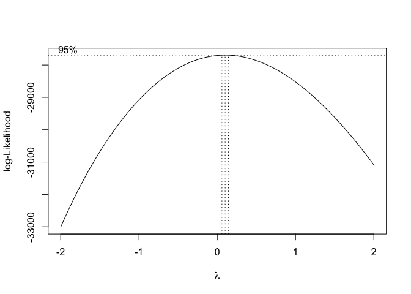<!-- -->

``` r
dur.mod = lmer(log(Total.Duration) ~ SRate + (1|Audiofile/Speaker_Number), data = si)

qqnorm(resid(dur.mod))
```

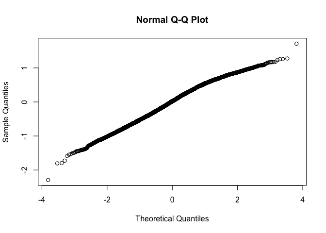<!-- -->

``` r
plot(allEffects(dur.mod))
```

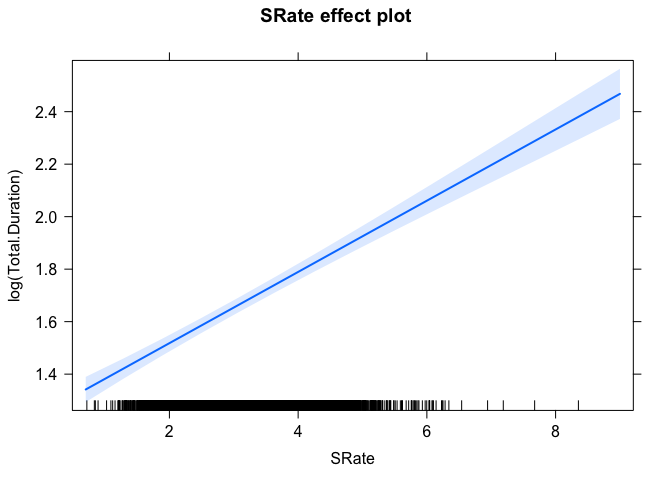<!-- -->

However, the two variables have opposite effects on the presence of
filled pauses. So, as speech rate increases, filled pauses are less
likely. However, the presence of variable contexts leads to pauses being
even **less** likely. For duration, which generally increases the
likelihood of filled pauses, the simultaneous presence of variable
contexts **still** decreases the likelihood of a filled pause.

Even when the associated effects on which the target variable is
“parasitic” are in different directions, the effect of the target
variable is the same. To me, this fact should be highlighted, as it
could significantly strengthen your claim.

Something that needs to be considered is what these variables mean. Are
they mainly indicative of personal speech style (e.g., speakers can be
classified into faster or slower, longer talkers or slower), speech
context (immediate, as in the idiosyncratic properties of an individual
turn, or more global, such as the broader discursive context), or
something else? And why would increased presence of variation help in
particular circumstances (i.e., for the fastest/longest speakers)?

**Silence model**

``` r
###############################
# Replication of reported model
###############################
# Check whether a power transform is necessary (using the Box-Cox method)
boxcox(lm(SilencebyWord ~ 1, data = si)) # squareroot is maybe a better match than log, but both are probably OK
```

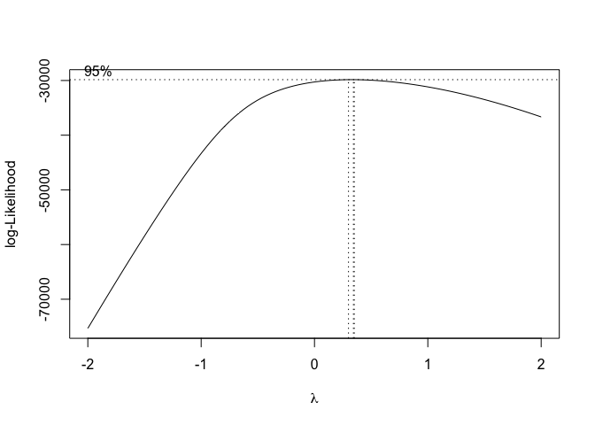<!-- -->

``` r
# Replication
sil.mod = lmer(log(SilencebyWord) ~ NVarbBinary*Total.Duration.scaled + AvgChar.scaled + SRate.scaled + (1|Speaker_Number), data = si)

summary(sil.mod)
```

    ## Linear mixed model fit by REML. t-tests use Satterthwaite's method [
    ## lmerModLmerTest]
    ## Formula: 
    ## log(SilencebyWord) ~ NVarbBinary * Total.Duration.scaled + AvgChar.scaled +  
    ##     SRate.scaled + (1 | Speaker_Number)
    ##    Data: si
    ## 
    ## REML criterion at convergence: 13486.3
    ## 
    ## Scaled residuals: 
    ##     Min      1Q  Median      3Q     Max 
    ## -9.2687 -0.4572  0.1313  0.5816  4.4449 
    ## 
    ## Random effects:
    ##  Groups         Name        Variance Std.Dev.
    ##  Speaker_Number (Intercept) 0.1215   0.3486  
    ##  Residual                   0.3750   0.6123  
    ## Number of obs: 7171, groups:  Speaker_Number, 34
    ## 
    ## Fixed effects:
    ##                                            Estimate Std. Error         df
    ## (Intercept)                              -2.429e+00  6.116e-02  3.415e+01
    ## NVarbBinarypresent                       -1.363e-02  1.637e-02  7.140e+03
    ## Total.Duration.scaled                    -3.243e-02  1.259e-02  7.143e+03
    ## AvgChar.scaled                           -6.341e-02  7.633e-03  7.138e+03
    ## SRate.scaled                             -3.794e-01  8.311e-03  7.153e+03
    ## NVarbBinarypresent:Total.Duration.scaled -5.547e-03  1.599e-02  7.136e+03
    ##                                          t value Pr(>|t|)    
    ## (Intercept)                              -39.721   <2e-16 ***
    ## NVarbBinarypresent                        -0.833    0.405    
    ## Total.Duration.scaled                     -2.575    0.010 *  
    ## AvgChar.scaled                            -8.307   <2e-16 ***
    ## SRate.scaled                             -45.649   <2e-16 ***
    ## NVarbBinarypresent:Total.Duration.scaled  -0.347    0.729    
    ## ---
    ## Signif. codes:  0 '***' 0.001 '**' 0.01 '*' 0.05 '.' 0.1 ' ' 1
    ## 
    ## Correlation of Fixed Effects:
    ##             (Intr) NVrbBn Ttl.D. AvgCh. SRt.sc
    ## NVrbBnryprs -0.130                            
    ## Ttl.Drtn.sc  0.071 -0.265                     
    ## AvgChr.scld -0.004  0.008 -0.127              
    ## SRate.scald  0.029 -0.222 -0.111  0.265       
    ## NVrbBn:T.D. -0.057  0.051 -0.757  0.044  0.051

``` r
qqnorm(resid(sil.mod))
```

<!-- -->

``` r
# Squareroot transform
sil.mod.sqrt = lmer(SilencebyWord^0.5 ~ NVarbBinary*Total.Duration.scaled + AvgChar.scaled + SRate.scaled + (1|Speaker_Number), data = si)

summary(sil.mod.sqrt)
```

    ## Linear mixed model fit by REML. t-tests use Satterthwaite's method [
    ## lmerModLmerTest]
    ## Formula: 
    ## SilencebyWord^0.5 ~ NVarbBinary * Total.Duration.scaled + AvgChar.scaled +  
    ##     SRate.scaled + (1 | Speaker_Number)
    ##    Data: si
    ## 
    ## REML criterion at convergence: -14910.8
    ## 
    ## Scaled residuals: 
    ##     Min      1Q  Median      3Q     Max 
    ## -3.9224 -0.5835  0.0082  0.5597  4.5842 
    ## 
    ## Random effects:
    ##  Groups         Name        Variance Std.Dev.
    ##  Speaker_Number (Intercept) 0.002231 0.04723 
    ##  Residual                   0.007125 0.08441 
    ## Number of obs: 7171, groups:  Speaker_Number, 34
    ## 
    ## Fixed effects:
    ##                                            Estimate Std. Error         df
    ## (Intercept)                               3.185e-01  8.292e-03  3.390e+01
    ## NVarbBinarypresent                       -2.633e-03  2.256e-03  7.140e+03
    ## Total.Duration.scaled                    -7.863e-03  1.736e-03  7.143e+03
    ## AvgChar.scaled                           -8.283e-03  1.052e-03  7.138e+03
    ## SRate.scaled                             -5.841e-02  1.146e-03  7.153e+03
    ## NVarbBinarypresent:Total.Duration.scaled  1.545e-03  2.204e-03  7.136e+03
    ##                                          t value Pr(>|t|)    
    ## (Intercept)                               38.414  < 2e-16 ***
    ## NVarbBinarypresent                        -1.167    0.243    
    ## Total.Duration.scaled                     -4.530 6.00e-06 ***
    ## AvgChar.scaled                            -7.872 4.01e-15 ***
    ## SRate.scaled                             -50.981  < 2e-16 ***
    ## NVarbBinarypresent:Total.Duration.scaled   0.701    0.483    
    ## ---
    ## Signif. codes:  0 '***' 0.001 '**' 0.01 '*' 0.05 '.' 0.1 ' ' 1
    ## 
    ## Correlation of Fixed Effects:
    ##             (Intr) NVrbBn Ttl.D. AvgCh. SRt.sc
    ## NVrbBnryprs -0.132                            
    ## Ttl.Drtn.sc  0.073 -0.265                     
    ## AvgChr.scld -0.004  0.008 -0.127              
    ## SRate.scald  0.029 -0.222 -0.111  0.265       
    ## NVrbBn:T.D. -0.058  0.051 -0.757  0.044  0.051

``` r
qqnorm(resid(sil.mod.sqrt)) # better approx. of normality for model residuals
```

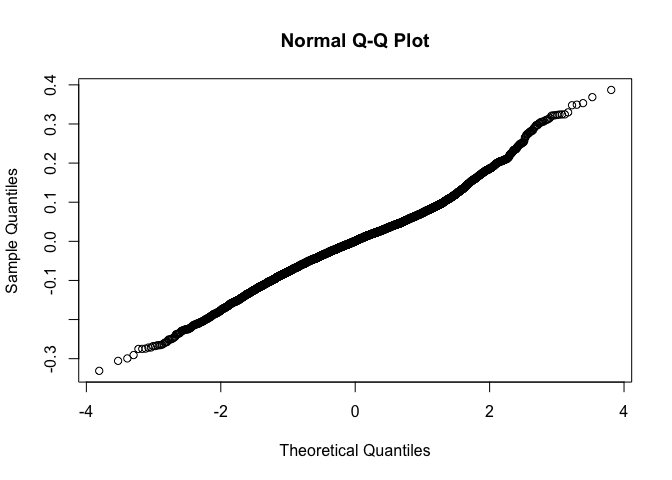<!-- -->

``` r
# Without scaling
sil.mod.no.scale = lmer(log(SilencebyWord) ~ NVarbBinary*Total.Duration + AvgChar + SRate + (1|Speaker_Number), data = si)

summary(sil.mod.no.scale)
```

    ## Linear mixed model fit by REML. t-tests use Satterthwaite's method [
    ## lmerModLmerTest]
    ## Formula: log(SilencebyWord) ~ NVarbBinary * Total.Duration + AvgChar +  
    ##     SRate + (1 | Speaker_Number)
    ##    Data: si
    ## 
    ## REML criterion at convergence: 13489.5
    ## 
    ## Scaled residuals: 
    ##     Min      1Q  Median      3Q     Max 
    ## -9.2687 -0.4572  0.1313  0.5816  4.4449 
    ## 
    ## Random effects:
    ##  Groups         Name        Variance Std.Dev.
    ##  Speaker_Number (Intercept) 0.1215   0.3486  
    ##  Residual                   0.3750   0.6123  
    ## Number of obs: 7171, groups:  Speaker_Number, 34
    ## 
    ## Fixed effects:
    ##                                     Estimate Std. Error         df t value
    ## (Intercept)                       -4.549e-01  8.923e-02  1.535e+02  -5.098
    ## NVarbBinarypresent                -3.391e-03  3.301e-02  7.137e+03  -0.103
    ## Total.Duration                    -9.771e-03  3.794e-03  7.143e+03  -2.575
    ## AvgChar                           -1.140e-01  1.372e-02  7.138e+03  -8.307
    ## SRate                             -4.659e-01  1.021e-02  7.153e+03 -45.649
    ## NVarbBinarypresent:Total.Duration -1.671e-03  4.818e-03  7.136e+03  -0.347
    ##                                   Pr(>|t|)    
    ## (Intercept)                       9.97e-07 ***
    ## NVarbBinarypresent                   0.918    
    ## Total.Duration                       0.010 *  
    ## AvgChar                            < 2e-16 ***
    ## SRate                              < 2e-16 ***
    ## NVarbBinarypresent:Total.Duration    0.729    
    ## ---
    ## Signif. codes:  0 '***' 0.001 '**' 0.01 '*' 0.05 '.' 0.1 ' ' 1
    ## 
    ## Correlation of Fixed Effects:
    ##             (Intr) NVrbBn Ttl.Dr AvgChr SRate 
    ## NVrbBnryprs -0.075                            
    ## Total.Durtn -0.100  0.545                     
    ## AvgChar     -0.626 -0.035 -0.127              
    ## SRate       -0.468 -0.156 -0.111  0.265       
    ## NVrbBnr:T.D  0.115 -0.869 -0.757  0.044  0.051

``` r
qqnorm(resid(sil.mod.no.scale))
```

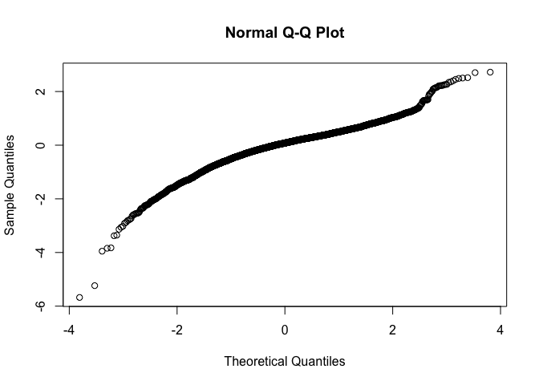<!-- -->

I have tried to replicate your results for the silence model, but no
matter how I apply the transforms, I can’t seem to arrive at the same
coefficients. A prime example of why one should provide their own code
and complete dataset (I can’t know *why* what I get doesn’t look like
what you got). However, the results hold up.

I leave it here (if the authors are interested, I recommend examining
the other variants of the analysis applied to the filled pauses).
